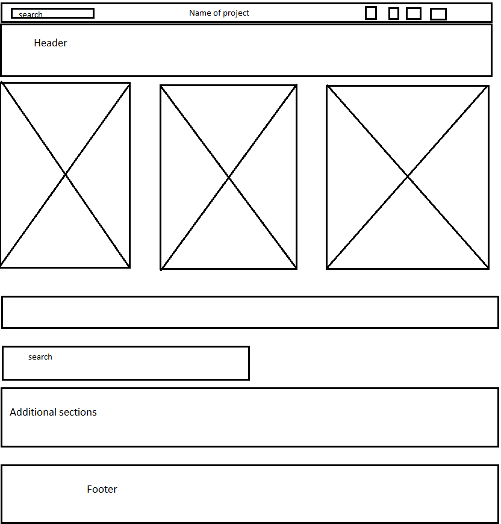

# NutriRec

## This site For Project 301d28 in order to build full stack site using

(MERN)

1. React
2. Node
3. Mongo
4. Express

## with the usage of deferent API's

1. Edamam Recipes
2. Edamam nutrition
3. Open Food Facts
4. TheMealDB

## Team Member

1. Ma'moun Hussein
2. Morad Al-Khatib
3. Yazan Al-Kharabsheh
4. Hiba Al-Made

### WireFrame

#### Change Log

19/8/2021 16:11 - initial commit
